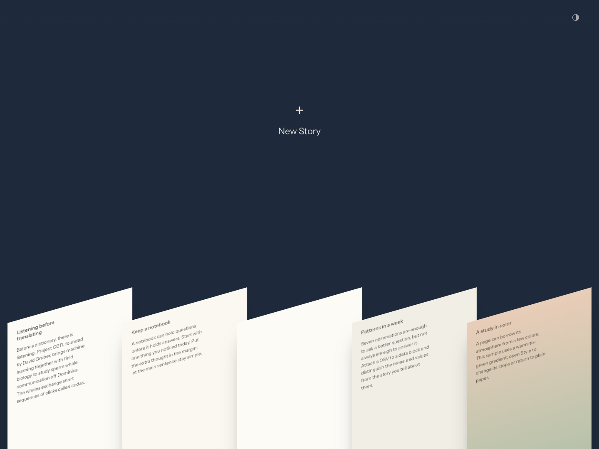
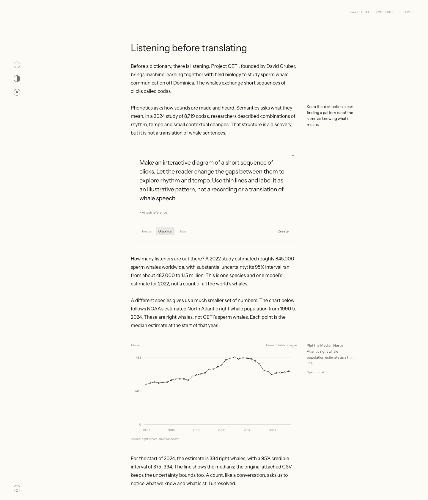

# FOLIO

for writing and storytelling. my ideal tool for combining writing, revising, and expansive visual exploration on the same page. scribble in the margins. integrate interactive graphics, data visualizations, and moving text with live code blocks in a meditative studio.

each word will be yours. agents are opt-in, and help with coding visual effects, interactive graphics, or research.

currently, your stories live in your browser and nothing syncs to a cloud account.

//

[hosting and storage](docs/hosting.md) · [development](docs/development.md) · [design rules](docs/design-rules.md)
